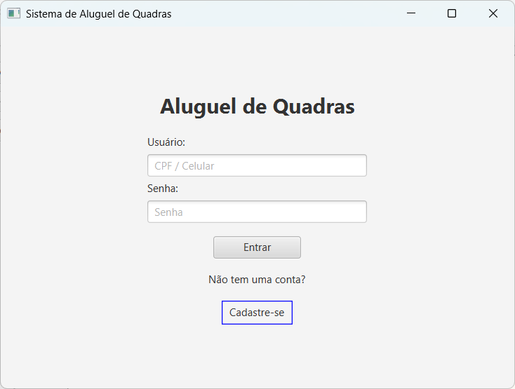
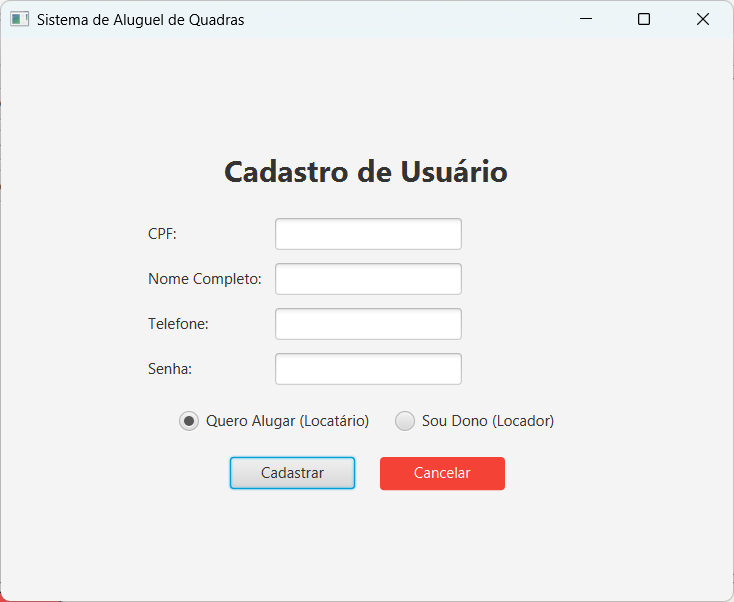
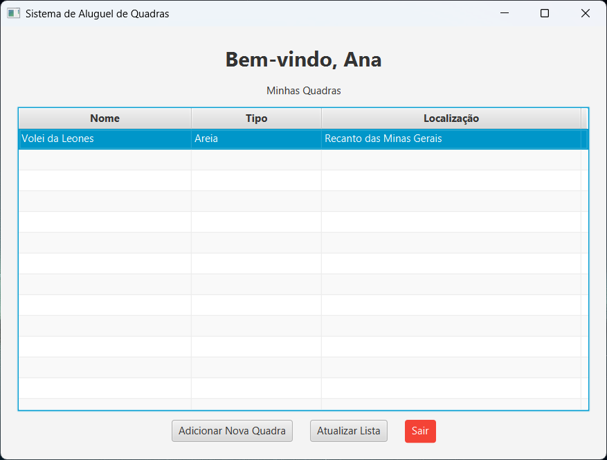
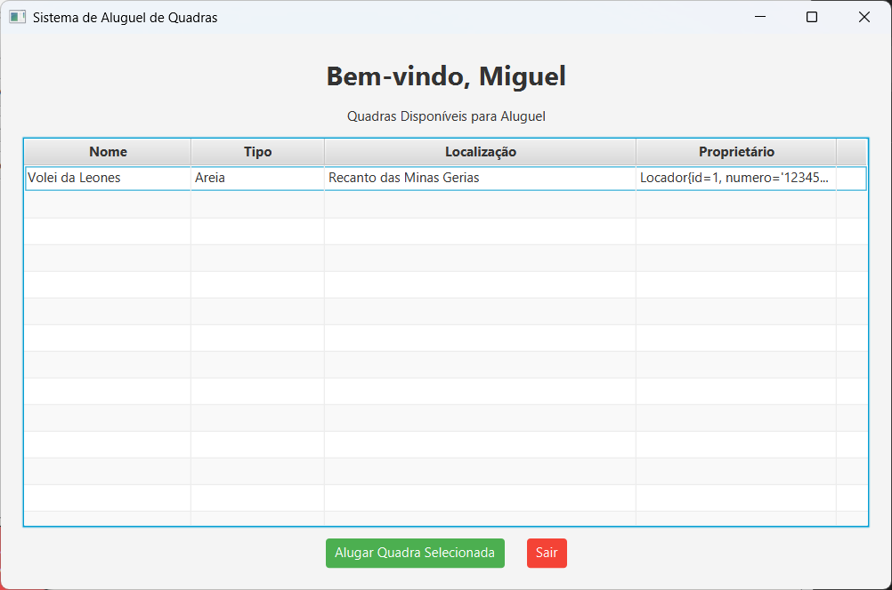
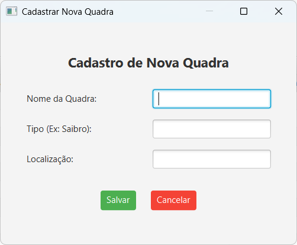
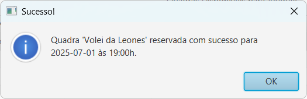
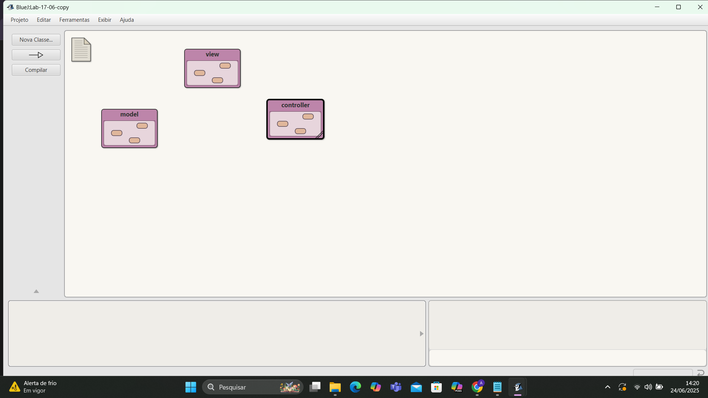

# APP para aluguel de quadras de esportes

## Motivação
A motivação para o desenvolvimento deste sistema surge da necessidade de proporcionar uma solução prática e acessível para usuários que desejam alugar quadras esportivas, bem como para proprietários que buscam gerenciar seus espaços de forma eficiente. O sistema visa melhorar a experiência do usuário, reduzir erros operacionais e promover a automação do processo de reservas, contribuindo para a organização e a satisfação de todas as partes envolvidas.

---

### Plano de desenvolvimento:

**Objetivo geral:**  

Desenvolver um sistema de software que permita aos usuários cadastrarem-se, consultarem a disponibilidade de quadras esportivas, escolherem horários e tipos de quadras, visualizarem os valores associados e realizarem a reserva de forma automatizada, eficiente e confiável, garantindo que não haja sobreposição de horários e simplificando o processo de escolha.

**Objetivos Específicos:** 

Implementar um sistema de cadastro de usuários com informações básicas (nome e número de telefone) para autenticação e personalização.
Criar uma interface que exiba os tipos de quadras disponíveis (ex.: vôlei, futebol, basquete), horários livres e os respectivos preços.
Desenvolver uma lógica de back-end que impeça a sobreposição de reservas no mesmo horário e quadra.
Integrar um módulo de confirmação de reservas com notificações para o usuário.
Garantir a usabilidade do sistema com uma interface amigável e intuitiva para o front-end.
Documentar o desenvolvimento do projeto, incluindo modelagem, implementação e testes.

---

### Membros da equipe:

- [Clara](https://github.com/claraleones): Gerenciamento/Documentação.
- [Khalil](https://github.com/Khalielly): Back-end.
- [Miguel](https://github.com/miguelccs10): front-end  
- [Diniz](https://github.com/dinizanjos): Documentação.  
- [Heitor](https://github.com/Heitortxl): Validação e Testes.
  
---

### Modelagem inicial:
A modelagem do sistema será composta por:

## - Diagramas de classes

Esse diagrama foi feito por: [Khalil](https://github.com/Khalielly)
Essa é apenas a primeira versão do diagrama.


Diagrama de classes final:

![Diagrama UML](https://www.plantuml.com/plantuml/png/fLNFRji-3BxxAOYUab-JujThK1GjMXJjq1LRsps0OhE9Daiq93c7_NcOOQUTzmXviKaEBRkMiwtepIG_Vlf8YVIPTSAuMfMP_IHr9OnGe4XJlZQa49ofCSloKbWB7smjZ2JuaW7CPR40gLturBL2GmjuS4RgLUFngNtRebwBdkDmXUwcc4nRYaFRsCmvPSHTmnjGNQADxkUdnXnIc6O4Pz0qH3y4NKCuUrlDdF2jxS8jvQ8Wi-k2mnAVIEEWjaTs9zGn41F73t3SwF4ZvgM7bFApo0MzhqLXH3_eP3NYNPC9dFPIsegqtA2qhnVDcRT3EGb5YkYLCAHxv09Iddx8bvbaNgT59XHZcBOv8xTnAPnO2ekxooZOkXFF7tXEMcFk9Ea5l2cM-KMq7wWsERA-pZsPxWVc9LcSH0rnyEwn8YiTnQTH2EBGmkka4pPcSACThj2SCeYVx0x4nYZ8TLpHx83SmBOZasBfeMnC6-46XSD9pPfQtTFu5K3BskR2l2CpEiVFiQ9sg9tq-05i1ZoUCMj9LABG8QkkYb4P8LPWYVjY9OdYof3gRQ88QEFdPHckxbPQrxRxjBketTDC5cJwrkEWlc0f9hFsfodxstoDJXRFL383zsZHRDAwmZGqJm3_MRu7XwcEIPPT7LNlN1xLv5mUrnijSqaZI-vAgXVtzRh7cNHd4ELZakqJJq_pOoX93kMsVzQJh_Dv-uD9dIwOsSWoeFdy50wE3-8qPipHE9lW_qT7_ntm-ymYsJ3E5vtjSCCe5v4ngWiVH-OqrALbcXo2aQkr0thgLGHmxenSreui97-s6NJ_Cq2F7VcHWTt-872eAZBRxo7O80lSe0AB1XHjPE6zbV0aBLShx2X3NK0GDvIOjjgpljt-T1J8Tcjc1hkLCeDkVJIdyxO0j2wegqgXyQFmYJDGmeBsJe-IgYfHeNOX0feWt_ugv8f0k5gK-wLnlm4kmgHWf1UpXhdFA_Qoy7s_ceOR-NAQC_zPg_8t)

## - Diagramas de sequência;

Primeiro diagrama de sequência:


Diagrama de sequência final:


## - Diagrama de Casos de uso;

Esta é apenas a primeira versão do diagrama.


Diagrama de casos de uso final:


## Telas finais da aplicação:
|       |       |
|-------|-------|
|||
|||
|||

---

## - Modelagem inicial no BlueJ;
Formatação inicial do Model, View e Controller:

Modelagem inicial do Model:


### - Classe Usuario;
```
package model;

import com.j256.ormlite.table.DatabaseTable;
import com.j256.ormlite.field.DatabaseField;
import com.j256.ormlite.field.DataType;

@DatabaseTable(tableName = "usuarios")
public class Usuario {
    @DatabaseField(generatedId = true)
    private int id;

    @DatabaseField(dataType = DataType.STRING, canBeNull = false)
    private String numero;

    @DatabaseField(dataType = DataType.STRING, canBeNull = false)
    private String nome;

    @DatabaseField(dataType = DataType.STRING, canBeNull = false)
    private String senha;

    public Usuario() {
        // Construtor padrão necessário para ORMLite
    }

    public Usuario(String numero, String nome, String senha) {
        this.numero = numero;
        this.nome = nome;
        this.senha = senha;
    }

    // GET e SET methods
    public int getId() {
        return this.id;
    }

    public void setId(int id) {
        this.id = id;
    }

    public String getNumero() {
        return this.numero;
    }

    public void setNumero(String numero) {
        this.numero = numero;
    }

    public String getNome() {
        return this.nome;
    }

    public void setNome(String nome) {
        this.nome = nome;
    }

    public String getSenha() {
        return this.senha;
    }

    public void setSenha(String senha) {
        this.senha = senha;
    }

    @Override
    public String toString() {
        return "Usuario{id=" + id + ", numero='" + numero + "', nome='" + nome + "', senha='[PROTEGIDA]'}";
    }
}
```
### - Classe Locador;
```
package model;

import com.j256.ormlite.table.DatabaseTable;
import com.j256.ormlite.field.DatabaseField;
import com.j256.ormlite.field.DataType;

@DatabaseTable(tableName = "locadores")
public class Locador extends Usuario {
    @DatabaseField(dataType = DataType.STRING)
    private String telefone;
    public Locador() {
        // Construtor padrão necessário para ORMLite
    }

    public Locador(String numero, String nome, String senha, String telefone) {
        super(numero, nome, senha);
        this.telefone = telefone;
    }

    public String getTelefone() {
        return this.telefone;
    }

    public void setTelefone(String telefone) {
        this.telefone = telefone;
    }

    @Override
    public String toString() {
        return "Locador{id=" + getId() + ", numero='" + getNumero() + "', nome='" + getNome() + "', telefone='" + telefone + "', senha='[PROTEGIDA]'}";
    }
}
```
### - Classe Locatario;
```
  package model;

import com.j256.ormlite.table.DatabaseTable;
import com.j256.ormlite.field.DatabaseField;
import com.j256.ormlite.field.DataType;

@DatabaseTable(tableName = "locatarios")
public class Locatario extends Usuario {
    @DatabaseField(dataType = DataType.STRING)
    private String telefone;

    @DatabaseField(dataType = DataType.STRING)
    private String localizacaoQuadra;

    @DatabaseField(dataType = DataType.STRING)
    private String tipoQuadra;

    @DatabaseField(dataType = DataType.STRING)
    private String horariosDisponiveis;

    public Locatario() {
        // Construtor padrão necessário para ORMLite
    }

    public Locatario(String numero, String nome, String senha, String telefone, String localizacaoQuadra, String tipoQuadra, String horariosDisponiveis) {
        super(numero, nome, senha);
        this.telefone = telefone;
        this.localizacaoQuadra = localizacaoQuadra;
        this.tipoQuadra = tipoQuadra;
        this.horariosDisponiveis = horariosDisponiveis;
    }

    public String getTelefone() {
        return this.telefone;
    }

    public void setTelefone(String telefone) {
        this.telefone = telefone;
    }

    public String getLocalizacaoQuadra() {
        return this.localizacaoQuadra;
    }

    public void setLocalizacaoQuadra(String localizacaoQuadra) {
        this.localizacaoQuadra = localizacaoQuadra;
    }

    public String getTipoQuadra() {
        return this.tipoQuadra;
    }

    public void setTipoQuadra(String tipoQuadra) {
        this.tipoQuadra = tipoQuadra;
    }

    public String getHorariosDisponiveis() {
        return this.horariosDisponiveis;
    }

    public void setHorariosDisponiveis(String horariosDisponiveis) {
        this.horariosDisponiveis = horariosDisponiveis;
    }

    @Override
    public String toString() {
        return "Locatario{id=" + getId() + ", numero='" + getNumero() + "', nome='" + getNome() + "', telefone='" + telefone + "', localizacaoQuadra='" + localizacaoQuadra + "', tipoQuadra='" + tipoQuadra + "', horariosDisponiveis='" + horariosDisponiveis + "', senha='[PROTEGIDA]'}";
    }
}
```
### - UsuarioRepositorio;
```
package model;

import com.j256.ormlite.dao.DaoManager;
import com.j256.ormlite.dao.Dao;
import com.j256.ormlite.table.TableUtils;
import java.sql.SQLException;
import java.util.List;
import java.util.ArrayList;

public class UsuarioRepositorio {
    private static Database database;
    private static Dao<Usuario, Integer> daoUsuario;
    private static Dao<Locador, Integer> daoLocador;
    private static Dao<Locatario, Integer> daoLocatario;
    private List<Usuario> loadedUsuarios;
    private Usuario loadedUsuario;

    public UsuarioRepositorio(Database database) {
        UsuarioRepositorio.setDatabase(database);
        loadedUsuarios = new ArrayList<Usuario>();
    }

    public static void setDatabase(Database database) {
        UsuarioRepositorio.database = database;
        try {
            // Criar DAOs para cada entidade
            daoUsuario = DaoManager.createDao(database.getConnection(), Usuario.class);
            daoLocador = DaoManager.createDao(database.getConnection(), Locador.class);
            daoLocatario = DaoManager.createDao(database.getConnection(), Locatario.class);
            // Criar tabelas se não existirem
            TableUtils.createTableIfNotExists(database.getConnection(), Usuario.class);
            TableUtils.createTableIfNotExists(database.getConnection(), Locador.class);
            TableUtils.createTableIfNotExists(database.getConnection(), Locatario.class);
        } catch (SQLException e) {
            System.out.println("Erro ao configurar o banco de dados: " + e.getMessage());
        }
    }

    public Usuario create(Usuario usuario) {
        int nrows = 0;
        try {
            if (usuario instanceof Locador) {
                nrows = daoLocador.create((Locador) usuario);
            } else if (usuario instanceof Locatario) {
                nrows = daoLocatario.create((Locatario) usuario);
            } else {
                nrows = daoUsuario.create(usuario);
            }
            if (nrows == 0) {
                throw new SQLException("Erro: objeto não salvo");
            }
            this.loadedUsuario = usuario;
            loadedUsuarios.add(usuario);
        } catch (SQLException e) {
            System.out.println("Erro ao criar usuário: " + e.getMessage());
        }
        return usuario;
    }

    public void update(Usuario usuario) {
        try {
            if (usuario instanceof Locador) {
                daoLocador.update((Locador) usuario);
            } else if (usuario instanceof Locatario) {
                daoLocatario.update((Locatario) usuario);
            } else {
                daoUsuario.update(usuario);
            }
            // Atualizar a lista carregada (se necessário)
            int index = loadedUsuarios.indexOf(usuario);
            if (index != -1) {
                loadedUsuarios.set(index, usuario);
            }
        } catch (SQLException e) {
            System.out.println("Erro ao atualizar usuário: " + e.getMessage());
        }
    }

    public void delete(Usuario usuario) {
        try {
            if (usuario instanceof Locador) {
                daoLocador.delete((Locador) usuario);
            } else if (usuario instanceof Locatario) {
                daoLocatario.delete((Locatario) usuario);
            } else {
                daoUsuario.delete(usuario);
            }
            loadedUsuarios.remove(usuario);
        } catch (SQLException e) {
            System.out.println("Erro ao deletar usuário: " + e.getMessage());
        }
    }

    public Usuario loadFromId(int id) {
        try {
            // Tentar carregar de cada DAO, retornando o primeiro encontrado
            this.loadedUsuario = daoUsuario.queryForId(id);
            if (this.loadedUsuario == null) {
                this.loadedUsuario = daoLocador.queryForId(id);
            }
            if (this.loadedUsuario == null) {
                this.loadedUsuario = daoLocatario.queryForId(id);
            }
            if (this.loadedUsuario != null) {
                loadedUsuarios.add(this.loadedUsuario);
            }
        } catch (SQLException e) {
            System.out.println("Erro ao carregar usuário por ID: " + e.getMessage());
        }
        return this.loadedUsuario;
    }

    public List<Usuario> loadAll() {
        try {
            loadedUsuarios.clear();
            loadedUsuarios.addAll(daoUsuario.queryForAll());
            loadedUsuarios.addAll(daoLocador.queryForAll());
            loadedUsuarios.addAll(daoLocatario.queryForAll());
            if (!loadedUsuarios.isEmpty()) {
                this.loadedUsuario = loadedUsuarios.get(0);
            }
        } catch (SQLException e) {
            System.out.println("Erro ao carregar todos os usuários: " + e.getMessage());
        }
        return loadedUsuarios;
    }
}
```

### - DataBase;
```
 package model;

import java.sql.SQLException;
import com.j256.ormlite.jdbc.JdbcConnectionSource;

public class Database {
    private String databaseName = null;
    private JdbcConnectionSource connection = null;

    public Database(String databaseName) {
        this.databaseName = databaseName;
    }

    public JdbcConnectionSource getConnection() throws SQLException {
        if (databaseName == null) {
            throw new SQLException("database name is null");
        }
        if (connection == null) {
            try {
                connection = new JdbcConnectionSource("jdbc:sqlite:" + databaseName);
            } catch (Exception e) {
                System.err.println(e.getClass().getName() + ": " + e.getMessage());
                System.exit(0);
            }
        }
        return connection;
    }

    public void close() {
        if (connection != null) {
            try {
                connection.close();
                this.connection = null;
            } catch (java.lang.Exception e) {
                System.err.println(e);
            }
        }
    }
}
```


