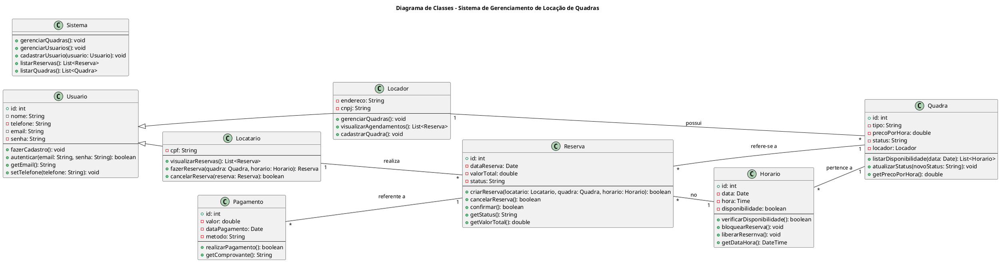

## Por planejamento do projeto, espera-se que os seguintes objetivos sejam atingidos:

### - Seção 1 - Introdução:
A gestão manual de reservas de quadras esportivas frequentemente resulta em conflitos de agendamento, como a locação do mesmo espaço para diferentes usuários no mesmo horário. Esse problema causa transtornos. A ausência de um sistema automatizado e centralizado dificulta a organização, a transparência e a confiabilidade no processo de aluguel de quadras. Um sistema digitalizado pode resolver essas questões, oferecendo maior comodidade aos usuários e eficiência aos proprietários.
O problema central é a falta de um sistema que gerencie de forma eficiente e confiável as reservas de quadras esportivas, garantindo que não haja sobreposição de horários e simplificando o processo de escolha e pagamento. Atualmente, os processos manuais ou parcialmente automatizados resultam em erros de agendamento, falta de clareza sobre horários disponíveis e dificuldade para os usuários confirmarem reservas.
A motivação para o desenvolvimento deste sistema surge da necessidade de proporcionar uma solução prática e acessível para usuários que desejam alugar quadras esportivas, bem como para proprietários que buscam gerenciar seus espaços de forma eficiente. O sistema visa melhorar a experiência do usuário, reduzir erros operacionais e promover a automação do processo de reservas, contribuindo para a organização e a satisfação de todas as partes envolvidas.

---

### - Seção 2 - Plano:

**Objetivo geral:**  

Desenvolver um sistema de software que permita aos usuários cadastrarem-se, consultarem a disponibilidade de quadras esportivas, escolherem horários e tipos de quadras, visualizarem os valores associados e realizarem a reserva de forma automatizada, garantindo que não haja conflitos de agendamento.

**Objetivos Específicos:** 

Implementar um sistema de cadastro de usuários com informações básicas (nome e número de telefone) para autenticação e personalização.
Criar uma interface que exiba os tipos de quadras disponíveis (ex.: vôlei, futebol, basquete), horários livres e os respectivos preços.
Desenvolver uma lógica de back-end que impeça a sobreposição de reservas no mesmo horário e quadra.
Integrar um módulo de confirmação de reservas com notificações para o usuário.
Garantir a usabilidade do sistema com uma interface amigável e intuitiva para o front-end.
Documentar o desenvolvimento do projeto, incluindo modelagem, implementação e testes.

---

### - Seção 3 - Divisão de tarefas:
Tarefas (issues), atribuição de tarefa, responsabilidades, prazos, etc.

- [Diniz](https://github.com/dinizanjos): Documentação.  
- [Khalil](https://github.com/Khalielly): Back-end.  
- [Heitor](https://github.com/Heitortxl): VAlidação e Testes.  
- [Miguel](https://github.com/miguelccs10) e [Clara](https://github.com/claraleones): front-end / gerenciamento

---

### - Seção 4 - Modelagem inicial:
A modelagem do sistema será composta por:

## - Diagramas de classes

Esse diagrama foi feito por: [Khalil](https://github.com/Khalielly)
Essa é apenas a primeira versão do diagrama.

- Diagramas de sequência;

- Casos de uso;

Esse diagrama foi feito por: Ana Clara Leones
Esta é apenas a primeira versão do diagrama

  
